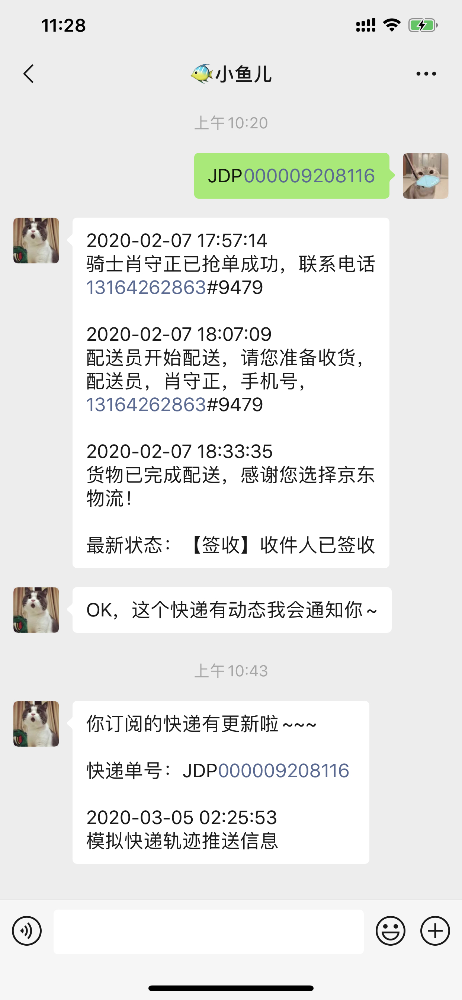

## 前言
  我个人是个急性子，平时购买会经常关注快递到哪里。为了解决这个问题我个人编写了一个小程序用于查物流并开放使用，但还是解决不了实时推送快递物流动态的问题。直到看到 WeChaty 解决方案，它是适用于微信个人帐户的BotSDK，我已使用它解决实时推送快递物流动态的问题。

## WeChaty
  [Wechaty](https://wechaty.github.io/) 是适用于微信个人帐户的Bot SDK，可以帮助您创建6行JavaScript的机器人，并具有包括[Linux](https://travis-ci.com/wechaty/wechaty)，[Windows](https://ci.appveyor.com/project/wechaty/wechaty)，[Darwin（OSX / Mac）](https://travis-ci.com/Wechaty/wechaty)和[Docker](https://app.shippable.com/github/Wechaty/wechaty)在内的跨平台支持。

[](https://github.com/chatie/wechaty)
[](https://github.com/juzibot/Welcome/wiki/Everything-about-Wechaty)


  **全球最短的ChatBot代码：6行JavaScript**

  ```javascript
  const { Wechaty } = require('wechaty')
  Wechaty.instance()
  .on('scan', (qrcode, status) => console.log(`Scan QR Code to login: ${status}\nhttps://api.qrserver.com/v1/create-qr-code/?data=${encodeURIComponent(qrcode)}`))
  .on('login',            user => console.log(`User ${user} logined`))
  .on('message',       message => console.log(`Message: ${message}`))
  .start()
  ```

  > 引用 [WeChaty Github](https://wechaty.github.io/) 介绍，您可以从 [Wiki](https://github.com/Wechaty/wechaty/wiki/Examples) 和 [Example Directory中](https://github.com/Wechaty/wechaty/blob/master/examples/) 找到更多示例。

## 使用WeChaty实现推送
  - 微信好友发送快递单号获取实时物流轨迹信息，并自动订阅该快递
  - 订阅来源于快递100物流跟踪信息，并实时推送给微信好友

  

## 运行起来
1. ### 安装Node.js
   node官网：https://nodejs.org/zh-cn/
   Wechaty 要求Node.js版本10或以上，安装配置可参考 [《Node.js 安装配置| 菜鸟教程》](https://www.runoob.com/nodejs/nodejs-install-setup.html) ，官方[下载地址](https://nodejs.org/zh-cn/download/)。

2. ### 安装MongoDB
   MongoDB官网：https://www.mongodb.com/cn ，官方文档：[安装MongoDB手册](https://docs.mongodb.com/manual/installation/)
   推荐教程文章：[《MongoDB 简介》](https://www.runoob.com/mongodb/mongodb-intro.html)、[《Linux平台安装MongoDB》](https://www.runoob.com/mongodb/mongodb-linux-install.html)、[《window平台安装MongoDB》](https://www.runoob.com/mongodb/mongodb-window-install.html)、[《MongoDB 连接》](https://www.runoob.com/mongodb/mongodb-connections.html)

3. ### 克隆项目并配置
   项目地址：[https://github.com/mrwhh/wechaty-push-express](https://github.com/mrwhh/wechaty-push-express)  （我是从事Java开发，Node.js语法可能不太正确请见惊~）
   ```
   git clone git@github.com:mrwhh/wechaty-push-express.git
   ```
   MongoDB配置： `config/mongodb.js` 文件
   快递100 API配置：`config/kuaidi.js` 文件，快递100相关文档： [实时查询API](https://www.kuaidi100.com/openapi/api_post.shtml)、[订阅推送API](https://www.kuaidi100.com/openapi/api_subscribe.shtml)
   快递订阅回调地址配置：`config/kuaidi.js` 文件 `subscription`方法中修改你部署的地址。

4. ### 运行WeChaty
   先来安装一下
   ```
   cd wechaty-push-express
   npm install
   ```
   没有问题就可以运行WeChaty了
   ```
   WECHATY_PUPPET=wechaty-puppet-padplus WECHATY_PUPPET_PADPLUS_TOKEN=${Token} node mybot.js
   ```
   当您看到输出 `在WeChaty服务上监听 3000 端口...` 就是成功运行了～

## 您需要知道的事情
请勿使用此项目做违反微信团队相关规定或违法事情。尽量使用延时函数，防止被检测出类似机器人行为操作导致被微信团队禁止登录Web版本风险，因此您需要承担使用不当导致被禁止登录的风险，均与作者无关。

## 最后
基于WeChaty解决方案实现的实时推送物流轨迹通知是我个人兴趣开发并非商用，此项目开源仅供技术产品交流。对于开发者来说WeChaty是个很棒的产品，感谢WeChaty作者提供该解决方案。


